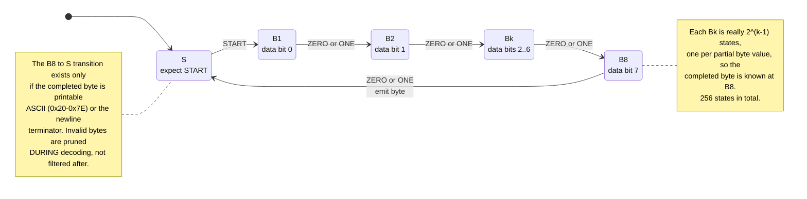
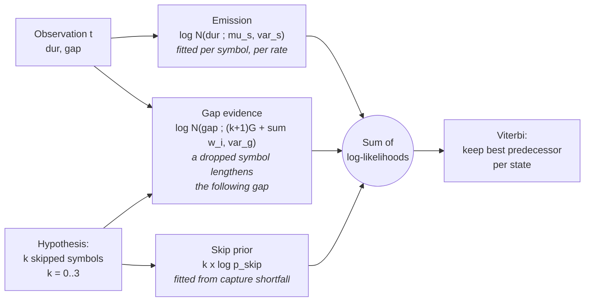

# Decoder Model

A hidden Markov model over the protocol's byte framing, decoded with Viterbi.
Hidden states are positions in the byte structure; observations are detected
pulses. Implemented in `src/ml/decoder.py`.

## State machine

The chain below is the *framing* constraint: exactly one START pulse followed
by eight data bits, then the byte closes and the chain returns to S.

Carrying the partial byte in the state is what makes the ASCII constraint
useful: a path that would complete an inadmissible byte is killed at B8 rather
than producing a candidate that has to be rejected later.

## Consuming one observation

Each detected pulse advances the chain by one transition, optionally preceded
by up to three *skips* — symbols the receiver never observed. Three independent
sources of evidence are summed in log space.

The gap term is what makes skips identifiable rather than merely permitted. A
symbol that goes undetected lengthens the next observed gap by its own width
plus one inter-symbol gap, so `gap` indicates both *that* a symbol was lost and
*which* one. Measured on hardware, every single-drop transmission carried this
trace.

## Parameters and how they are fitted

| Parameter | Fitted from | Notes |
|---|---|---|
| `mu_s`, `var_s` | Fully captured passes, labelled positionally | Exact labels — no alignment heuristic, so the emission model cannot inherit an alignment bug |
| `var_g` | Inter-symbol gaps in fully captured passes | |
| `p_skip` | Ratio of missing to expected symbols | Laplace-smoothed; a rate with no observed drops must still permit them |
| Transitions | Not fitted | Fixed by the protocol |

Emissions are generative rather than discriminative because Viterbi needs
`P(observation | symbol)` directly, not a posterior that would then have to be
divided back through the class priors.

## Two practical notes

**The first pulse of a transmission carries no usable gap.** Passes are split
on the beacon's 500 ms inter-message rest, so that first `gap` spans the rest
rather than an inter-symbol interval. Treating it as the latter made the
decoder insert phantom symbols trying to account for half a second, which threw
byte framing out of alignment for the remainder of the pass.

**Beam width matters more than it looks.** Paths trailing the leader by more
than the beam are pruned. A width of 80 log units cost 14 points of packet
success, because a path that posits a skip falls temporarily behind before the
framing constraint vindicates it. 400 is verified identical to exhaustive
search at every rate, and 10-18x faster.
